<!-- Generated by scripts/build.mjs from profile.config.json. Edit those, then run: node scripts/build.mjs -->

<a href="https://github.com/hold102"><picture><source media="(prefers-color-scheme: dark)" srcset="assets/header-dark.svg"></picture></a>

<picture><source media="(prefers-color-scheme: dark)" srcset="assets/overview-dark.svg"></picture>

<picture><source media="(prefers-color-scheme: dark)" srcset="assets/allocation-dark.svg"></picture>

<a href="https://github.com/hold102/JagaDuit_AI"><picture><source media="(prefers-color-scheme: dark)" srcset="assets/card-jaga-dark.svg"></picture></a>
<a href="https://github.com/brendan1107/UMH2026"><picture><source media="(prefers-color-scheme: dark)" srcset="assets/card-fnbg-dark.svg"></picture></a>

<a href="https://github.com/hold102/v0-project"><picture><source media="(prefers-color-scheme: dark)" srcset="assets/card-splt-dark.svg"></picture></a>
<a href="https://github.com/txy2612/TechWise"><picture><source media="(prefers-color-scheme: dark)" srcset="assets/card-twse-dark.svg"></picture></a>

<a href="https://github.com/hold102/UM-Study"><picture><source media="(prefers-color-scheme: dark)" srcset="assets/card-umst-dark.svg"></picture></a>
<a href="https://github.com/hold102/EduBridge1"><picture><source media="(prefers-color-scheme: dark)" srcset="assets/card-edub-dark.svg"></picture></a>

<b>More positions</b>: SmartFinance, RetainAI

 

| Project | What it is |
|:--|:--|
| [SmartFinance](https://github.com/hold102/SmartFinance) | Finance tracker with savings goals, streaks and spending insights (Expo + Next.js + Drizzle). Built at UTM x Hackathon. |
| [RetainAI](https://github.com/JosephLauTiewJung/hackathon-2026) | Churn-risk copilot for customer-success teams (Random Forest + structured GenAI). Hackathon team, contributor. |

<picture><source media="(prefers-color-scheme: dark)" srcset="assets/stack-dark.svg"></picture>

<a href="https://www.linkedin.com/in/YOUR-HANDLE"><picture><source media="(prefers-color-scheme: dark)" srcset="assets/key-1-dark.svg"></picture></a>
<a href="mailto:liangyao0808@gmail.com"><picture><source media="(prefers-color-scheme: dark)" srcset="assets/key-2-dark.svg"></picture></a>
<a href="https://github.com/hold102?tab=repositories"><picture><source media="(prefers-color-scheme: dark)" srcset="assets/key-3-dark.svg"></picture></a>

<picture><source media="(prefers-color-scheme: dark)" srcset="assets/footer-dark.svg"></picture>

