<!-- Generated by scripts/build.mjs from profile.config.json. Edit those, then run: node scripts/build.mjs -->

<a href="https://github.com/hold102"></a>



<a href="https://github.com/hold102/JagaDuit_AI"></a>
<a href="https://github.com/brendan1107/UMH2026"></a>

<a href="https://github.com/hold102/SplitEase"></a>
<a href="https://github.com/txy2612/TechWise"></a>

<a href="https://github.com/hold102/UM-Study"></a>
<a href="https://github.com/hold102/EduBridge"></a>

<b>More positions</b>: SmartFinance, RetainAI

 

| Project | What it is |
|:--|:--|
| [SmartFinance](https://github.com/hold102/SmartFinance) | Finance tracker with savings goals, streaks and spending insights (Expo + Next.js + Drizzle). Built at UTM x Hackathon. |
| [RetainAI](https://github.com/JosephLauTiewJung/hackathon-2026) | Churn-risk copilot for customer-success teams (Random Forest + structured GenAI). Hackathon team, contributor. |


<a href="https://www.linkedin.com/in/YOUR-HANDLE"></a>
<a href="mailto:liangyao0808@gmail.com"></a>
<a href="https://github.com/hold102?tab=repositories"></a>


